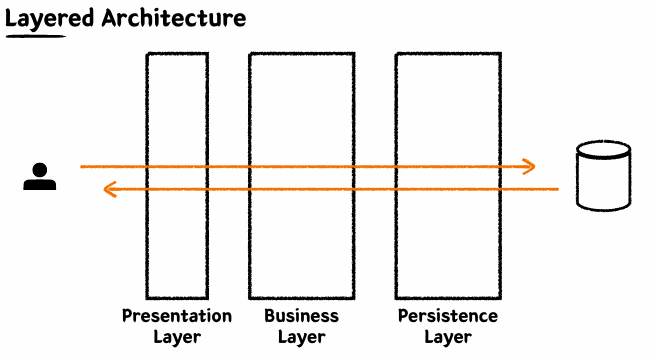

## Layered Architecture, 테스트

- 레이어를 구분한 이유는 관심사를 분리하기 위해서 이다.

#### Persistence Layer
- Data Access의 역할을 수행하는 계층이다.
- 비즈니스 가공 로직이 포함되어서는 안된다.
- Data에 대한 CRUD만 집중한 레이어.

#### Business Layer
- 비즈니스 로직을 구현하는 역할.
- Persistence Layer와의 상호작용을 통해 비즈니스 로직을 전개시킨다.
- **트랜잭션**을 보장해야한다.

#### Mocking
- Mock은 가짜라는 의미이다.
- 의존 관계를 가지고 있는 다른 객체 대신 가짜 객체를 주입하여 테스트하는 기법.

#### Presentation Layer
- 외부 세계의 요청을 가장 먼저 받는 계층.
- 파라미터에 대한 최소한의 검증을 수행한다.

#### 통합 테스트
- 여러 모듈이 협력하는 기능을 통합적으로 검증하는 테스트.
- 일반적으로 작은 범위의 단위 테스트만으로는 기능 전체의 신뢰성을 보장할 수 없다.
- 풍부한 단위 테스트와 큰 기능 단위를 검증하는 통합 테스트를 작성한다.

## Spring, JPA

#### Library vs Framework
- 라이브러리
  - 개발자가 작성한 코드가 주체가 되어 사용된다.
- 프레임워크
  - 개발자가 작성한 코드가 주체가 되어 사용되는 것이 아닌 프레임워크가 개발자의 코드를 사용하여 동작한다.

#### Spring
- IOC(Inversion of Control)
  - 대부분의 프레임워크가 가지고 있는 특징.
  - 객체의 생명주기의 관리를 애플리케이션이 아닌 프레임워크가 관리하는 특징.
- DI(Dependency Injection)
  - 애플리케이션에서 사용하는 객체의 생명 주기를 관리하는 IOC 컨테이너에서 다른 객체를 필요로하는 객체에 주입하는 개념.
- AOP(Aspect Oriented Programming)
  - 비즈니스 흐름에 관련이 없는 횡단 관심사를 분리시키고자 사용하는 기술
  - 프록시 기술을 활용하여 횡단 관심사를 분리시켰다.

#### JPA (Java Persistent API)
- ORM
  - OOP와 RDB의 패러다임의 불일치 문제를 해결하고자 등장.
  - 객체지향적으로 설계한 코드를 DB에 저장하기 위해 객체의 데이터를 매핑하여 DB에 저장, 조회
  - ORM을 사용해서 단순 작업을 줄이고, 비즈니스 로직에 집중할 수 있다.
- JPA
  - Java 진영의 ORM 기술 표준
  - 인터페이스이며 보통 Hiberante를 많이 사용함.
  - 반복적인 CRUD SQL을 생성 및 실행해주고, 여러 부가 기능들을 제공한다.
  - 편리하지만 쿼리를 직접 작성하지 않기 때문에, 어떤 식으로 쿼리가 만들어지는지 명확하게 이해해야함.
  - Query Dsl 조합하여 많이 사용함.

## 키워드 정리
- Layered Architecture
- Hexagonal Architecture
- 단위 테스트 vs 통합 테스트
- IoC, DI, AOP
- ORM, 패러다임 불일치, Hibernate
- Spring Data JPA
- 